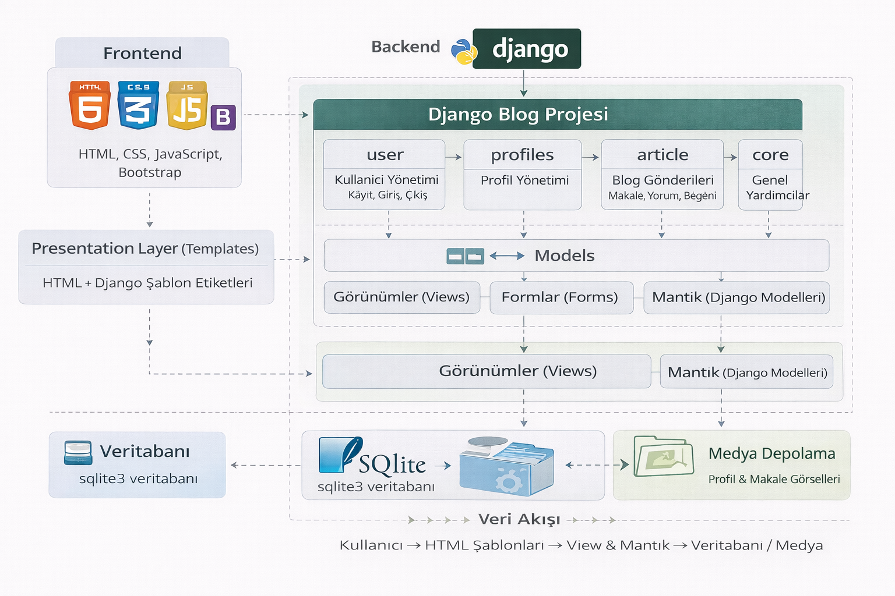

# Django Blog Project

Bu proje, Django framework kullanılarak geliştirilmiş, kullanıcı yönetimi odaklı bir blog uygulamasıdır.  
Amaç; Django’nun modüler yapısını kullanarak gerçek hayata yakın bir blog sistemi geliştirmek ve portföy amaçlı paylaşılabilir bir proje ortaya koymaktır.

---
## Canlı Demo

Projenin çalışan canlı halini görmek için aşağıdaki bağlantıyı ziyaret edebilirsiniz:

👉 **https://djangoblogweb.pythonanywhere.com**

---

## Uygulama Mimarisi

Aşağıda Django Blog projesinin genel mimari yapısı, kullanılan teknolojiler ve
uygulama bileşenlerinin birbiriyle olan etkileşimi gösterilmektedir.




## Proje Özellikleri

- Kullanıcı kayıt olma, giriş ve çıkış işlemleri
- Kullanıcı profil bilgileri ve kullanıcı bağlantılarının yönetimi
- Profil bilgilerini güncelleme
- Makale ekleme, silme ve güncelleme
- Makaleler için beğeni ve yorum sistemi
- Beğeni ve yorum sayılarına göre en aktif yazarlar listesi
- Kullanıcıya özel kontrol paneli üzerinden:
  - Makale yönetimi
  - Profil yönetimi
- Makalelerin:
  - Sayfalama (pagination) ile listelendiği sayfa
  - Detay içerik sayfası
- Veritabanına kayıt alan iletişim formu

---

## Kullanılan Teknolojiler

- **Backend**
  - Django
  - SQLite3 (demo ve geliştirme amaçlı)

- **Frontend**
  - HTML
  - CSS
  - JavaScript
  - Bootstrap

- **Django Yapısı**
  - Modüler uygulama yapısı
  - Template ve static dosya kullanımı
  - Django authentication sistemi
  - Django admin paneli

---

## Proje Uygulamaları (Apps)

- **DjangoBlog**  
  Ana proje uygulaması

- **article**  
  Makale işlemleri (ekleme, silme, güncelleme, listeleme, detay)

- **user**  
  Kullanıcı kayıt, giriş ve çıkış işlemleri

- **profiles**  
  Kullanıcı profil bilgileri ve kullanıcıya özel içerikler

---

## Medya ve Veritabanı

- **media/**  
  Profil fotoğrafları ve makale görselleri için kullanılır

- **Veritabanı**
  - SQLite3

> Bu projede, demo ve portföy amaçlı olarak SQLite veritabanı ve media dosyaları repository içerisinde tutulmuştur.  
> Gerçek bir production ortamında bu yapı farklı şekilde ele alınmalıdır.

---

## Kurulum

Projeyi local ortamda çalıştırmak için:

```bash
pip install -r requirements.txt
python manage.py migrate
python manage.py createsuperuser
python manage.py runserver
